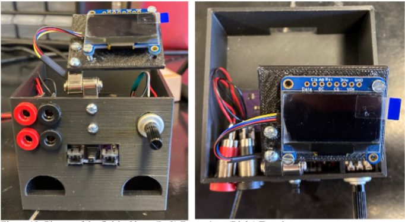

# Optogenetic Stimulators
Martin Trinh Bioengineering 2024 Capstone. This project aimed to create new optogenetic stimulator boxes for the Moritz Lab to control LED spinal cord implants.

# Optogenetic Stimulator Usage
A picture of the finished box is shown below. 

On the left is a front view picture of the box. To control an LED optogenetic implant, insert the LED anode wire into the **upper** red socket and LED cathode wire into the **upper** black socket. The **lower** red and black sockets can be used to plug in thermistor wires if applicable. *Note: The order the thermistor is plugged in does not matter.*

On the right is a top view picture of the box. The OLED monitor displays the voltage that is sent to the LED Driver (correlated with LED Intensity) and temperature if applicable.

# Necessary Materials per Box and Approximate Cost
See table below for necessary materials to construct one optogenetic box. **Ensure that the components bought will fit into the PCB and housing unit. If components do not fit, the files under "PCB Files" and "3D Printing Files" may need to be adjusted accordingly.**

| Name                                          | Quantity | Unit Price | Price per box |
|-----------------------------------------------|:--------:| :---: |:-------------:|
| PCB Board                                     |    1     | $5.33 |     $5.33     |
| Banana Plug                                   |    4     | $1.20 |     $4.80     |
| 500 mA Diode                                  |    1     | $0.36 |     $0.36     |
| 2 A Diode                                     |    1     | $0.45 |     $0.45     |
| N-Channel 60V 30A (Tc) 70W (Tc) TO-220 MOSFET |    1     | $1.45 |     $1.45     |
| 10 uF Capacitor                               |    2     | $0.17 |     $0.34     |
| 0.15 Ohm Resistor 1% Tolerance                |    1     | $0.69 |     $0.69     |
| 100 kOhm Resistor 0.1% Tolerance              |    1     | $0.39 |     $0.39     |
| 1 kOhm Resistor 5% Tolerance                  |    1     | $0.15 |     $0.15     |
| 10 kOhm Potentiometer                         |    1     | $1.61 |     $1.61     |
| AL8860WT-7 LED Driver                         |    1     | $0.68 |     $0.68     |
| 100 uH Inductor                               |    1     | $0.63 |     $0.63     |
| QT PY M0                                      |    1     | $7.50 |     $7.50     |
| JST-PH 2-pin                                  |    2     | $0.75 |     $1.50     |
| 10 Kohm Resistor 1% Tol                       |    1     |$0.10|     $0.10     |
| Hinge                                         |    1     |$3.80|     $3.80     |
| 7 Position Header                             |     2    |$0.62|     $1.24     |
| Push Button Switch DPST                       | 1 |$2.12|     $2.12     |
| PLA                                           | ~80 grams|$0.014/gram|     $1.12     |
| Stemma QT connector                           | 1 | $0.95|     $0.95     |
| OLED Display                                  | 1 | $17.50|    $17.50     |
| Lithium Ion Cylindrical Battery 3.7V 2.2 A    | 2 | $9.95|    $19.90     |
|                                               | | Total Cost |    $72.61     |
